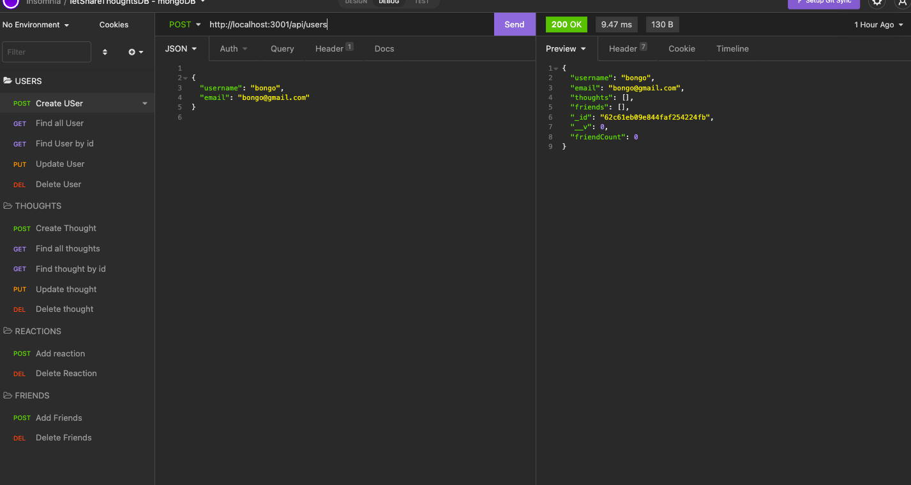
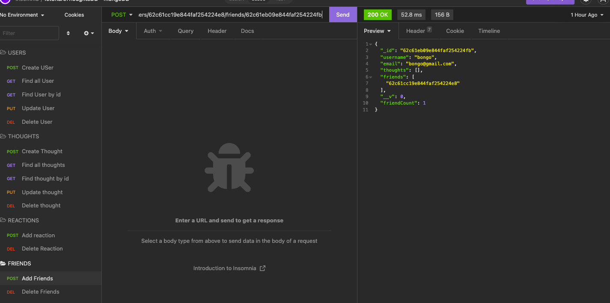

# Lets_Share_Thoughts-API

## Table of content

- [Description](#description)
- [Installation](#installation)
- [Usage](#usage)
- [License](#license)
- [Contributing](#contributiing)
- [Test](#test)
- [Questions](#questions)
- [Screenshots](#screenshots)
- [Links](#links)
- [Screenshot](#screenshot)

## Description

This is social network backend that uses NoSQL database (mongoDB),

## Installation

```
    gitclonegit@github.com:bongomin256/Lets_Share_Thoughts-API.git
   `cd Lets_Share_Thoughts-API`  in your local machine
   `npm i` to install all the dependencies
```

## Usage

```
    npm start
    npm run dev

```

## License

.
The license's link [MIT](https://opensource.org/licenses/MIT)

## Contribution

You can contribute to this project by getting in touch with me through my info below.

## Test

You have to download and and install ` insomnia` inorder to be able to run this application.

## Questions

This is the link to my [Github profile](https://github.com/bongomin256)
Incase of any question[s] or suggestion[s] concerning this appication, please contact me through this email:(bongomin@uw.edu)

## Links

- [Github repo](https://github.com/bongomin256/Lets_Share_Thoughts-API)
- [Link to a walk through video](https://youtu.be/eovZqo90210)

## Screenshots



